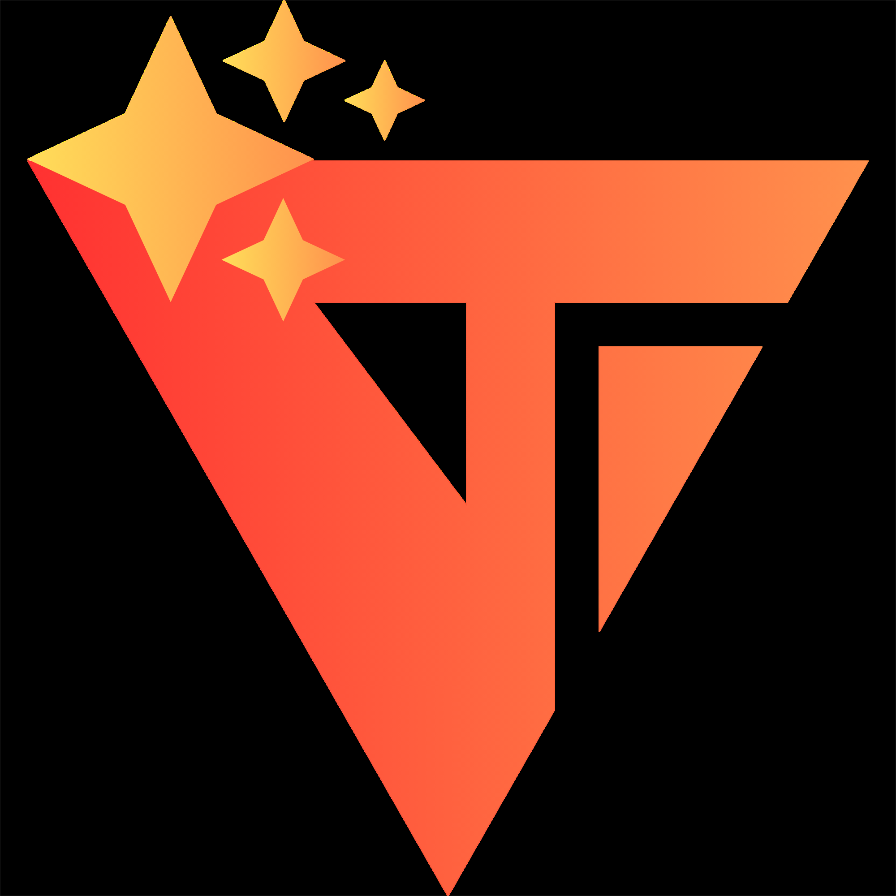

  

  # Toby Giongco

  **Writer • Web Developer • Social Justice Advocate**  
  *History, Tech, and People*

---

## About Me

I'm an undergraduate student at the **University of Santo Tomas–Manila**, currently pursuing a **Bachelor of Science in Information Technology** with a specialization in **Web and Application Development**.

Alongside my academic training, I stay active in civic and societal initiatives, applying technical work toward community engagement, social responsibility, and interdisciplinary collaboration. My work spans frontend development, web-based storytelling, digital portfolios, and historically grounded public-facing projects.

- 🎓 BS Information Technology student at **University of Santo Tomas**
- 📍 Based in **Cavite, Philippines**
- ✍️ Interested in the intersection of **history, technology, and people**
- 🛠️ Focused on building **clean, responsive, and purposeful web experiences**
- 🤝 Comfortable in collaborative, community-based, and mission-driven work

---

## Tech Stack

  
  
  
  
  
  
  
  
  
  
  
  
  
  
  

---

## Featured Projects

### The Philippine Left Timeline

  

An interactive historical timeline website that maps the development of labor, socialist, national democratic, and revolutionary organizations in the Philippines across distinct political periods.

**Highlights**
- Organized dense historical and political research into a browsable digital timeline
- Designed a responsive interface that makes long-form historical information easier to explore
- Built for clarity, structure, and accessibility across desktop and mobile devices

**Stack:** `Vue.js` `Vite` `Tailwind CSS`

---

### Diktador! Card Game Website

  

A promotional website for **Diktador!**, a politically themed card game, built to present the game's concept, visual identity, and overall experience through a focused and engaging frontend.

**Highlights**
- Translated the game's tone and branding into a cohesive digital presentation
- Built a clean, responsive layout for showcasing the card game to online audiences
- Emphasized visual storytelling, readability, and a strong thematic feel

**Stack:** `React` `Vite` `Bootstrap`

---

### Project Gunita Website

  

A website for **Project Gunita**, an initiative centered on historical memory, archival work, and public education, designed to make its mission and materials more accessible online.

**Highlights**
- Developed a structured site for presenting the organization's background, content, and public-facing materials
- Built responsive layouts suited for archival, educational, and advocacy-oriented content
- Focused on readability, maintainability, and a professional presentation of historically grounded work

**Stack:** `React` `Vite` `Bootstrap`

---

## Connect With Me

  
  
  

